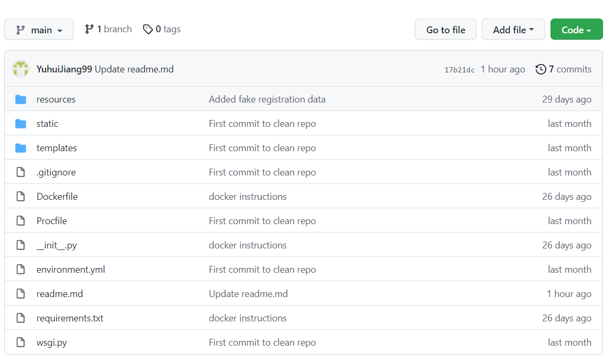
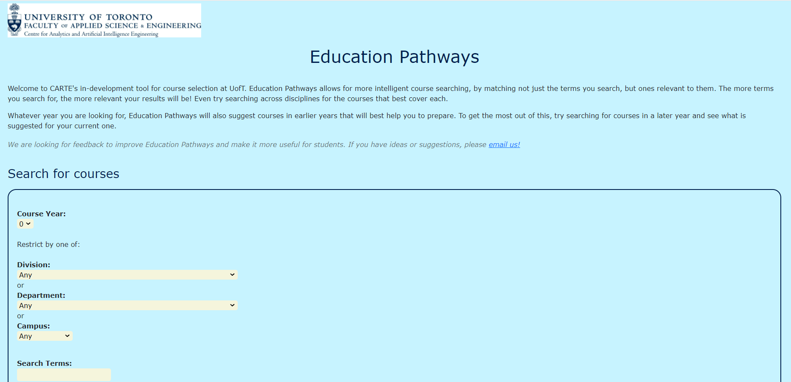
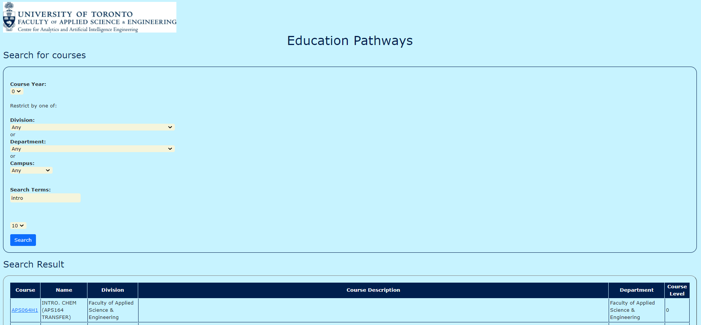

# ECE444-F2021-Lab5

Yuhui Jiang  
Note: This repo is a clone of https://github.com/nelaturuk/education_pathways.

## Activity1

## Activity2-5
Home Page
  

Results Page Form
  

Results Page Table

## Activity6
The information of the old UI is not well structured. All of the search field and text information are crowded together,
which makes it hard for the users to read the form and fill in their data. The new UI improves the readability by 
spliting up the form and text description with a border, adding line break among different search fields, and setting
up the attributes like font sizes, background color, etc.
